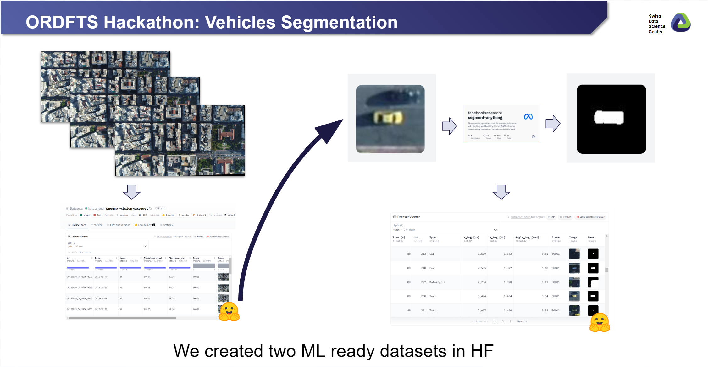

# ORD for the Sciences Hackathon - Vehicles Detection

[](https://renkulab.io/v2/projects/hackathon-team-1/pneuma-vehicles-detection) [](sdsc-ordes/ordfts-hackathon-vehicles-detection/blob/main/002_vehicles_detection.ipynb)
 [](https://github.com/sdsc-ordes/ordfts-hackathon-vehicles-detection) [](https://doi.org/10.5281/zenodo.12751861) [](https://huggingface.co/datasets/katospiegel/ordfts-hackathon-pneuma-vehicles-segmentation)


> [!CAUTION]
> This project is an example of a hackathon project. The quality of the data produced has not been evaluated. Its goal is to provide an example on how a dataset can be update to Hugginface. 

This is an example of a hackathon project presented to `ORD for the sciences hackathon` using the openly available [pNeuma vision dataset](https://zenodo.org/records/7426506). 

- [Go here if you wanna know more about the hackathon](https://sdsc-hackathons.ch/)
- [EPFL pNeuma project](https://open-traffic.epfl.ch)


## Description

The goal of this project is to create a training dataset derived from the publicly available pNeuma Vision dataset, which contains drone footage and coordinates of vehicles. By leveraging machine learning techniques, specifically the "Segment Anything" model by Meta, we will accurately segment and mask the pixels corresponding to each vehicle within the footage. The resulting dataset, stored in the efficient Parquet format, will be shared on Hugging Face as a new, open-access resource for the research community. Additionally, we will document our methodology in a detailed Jupyter notebook, which will be hosted in a public GitHub repository. Our work will be registered as a derived contribution in the pNeuma RDI Hub prototype, ensuring proper attribution and fostering further research and development.



Datasets created:

- [pneuma-vision-parquet](https://huggingface.co/datasets/katospiegel/pneuma-vision-parquet)
- [ordfts-hackathon-pneuma-vehicles-segmentation](https://huggingface.co/datasets/katospiegel/ordfts-hackathon-pneuma-vehicles-segmentation)


## How is structured this repository?

- 001_parquet_converter.ipynb: 
    - In this notebook we downloaded part of the original dataset pNeuma Vision, converted into parquet and then uploaded in Huggingface
- 002_vehicles_detection.ipynb
    - Here we take the coordinates of each vehicles tagged, we cropped an region of interest around it, and use Segment Anything by Meta in order to segment the vehicle.


## How to run this project in docker? 

```
docker build -t vehicles-detection . 
```

And then run with:

```
docker run -it --rm --gpus all --env-file .env odtp-whisperx
```

## Developed by: 

Developed by Carlos Vivar Rios (SDSC), as an example for the ORD for the sciences Hackathon.